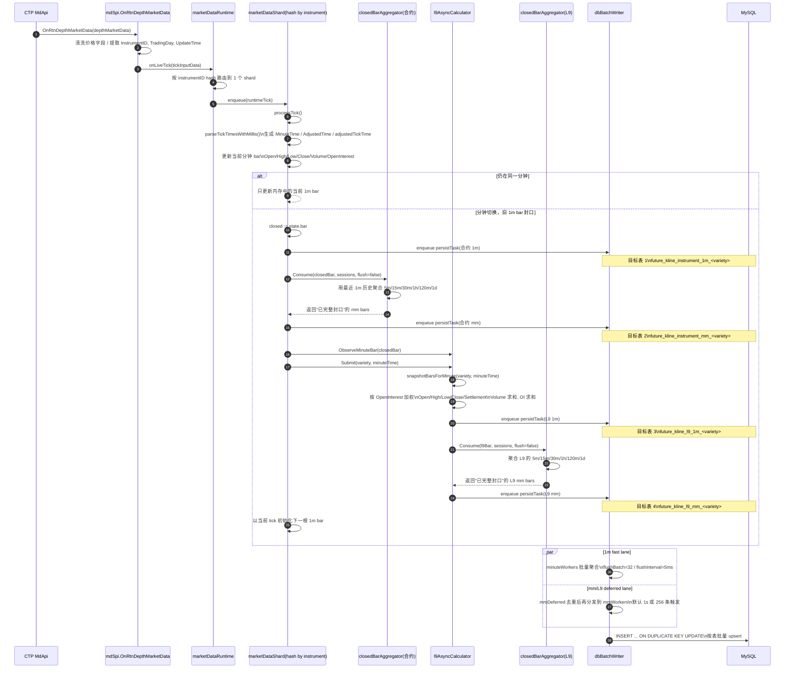

```mermaid
sequenceDiagram
    autonumber
    participant CTP as CTP MdApi
    participant SPI as mdSpi.OnRtnDepthMarketData
    participant RT as marketDataRuntime
    participant Shard as marketDataShard(hash by instrument)
    participant Agg as closedBarAggregator(合约)
    participant L9 as l9AsyncCalculator
    participant L9Agg as closedBarAggregator(L9)
    participant DBW as dbBatchWriter
    participant MySQL as MySQL

    CTP->>SPI: OnRtnDepthMarketData(depthMarketData)
    SPI->>SPI: 清洗价格字段 / 提取 InstrumentID, TradingDay, UpdateTime
    SPI->>RT: onLiveTick(tickInputData)

    RT->>RT: 按 instrumentID hash 路由到 1 个 shard
    RT->>Shard: enqueue(runtimeTick)

    Shard->>Shard: processTick()
    Shard->>Shard: parseTickTimesWithMillis()\n生成 MinuteTime / AdjustedTime / adjustedTickTime
    Shard->>Shard: 更新当前分钟 bar\nOpen/High/Low/Close/Volume/OpenInterest

    alt 仍在同一分钟
        Shard-->>Shard: 只更新内存中的当前 1m bar
    else 分钟切换，旧 1m bar 封口
        Shard->>Shard: closed := state.bar
        Shard->>DBW: enqueue persistTask(合约 1m)
        Note over DBW,MySQL: 目标表 1\nfuture_kline_instrument_1m_<variety>

        Shard->>Agg: Consume(closedBar, sessions, flush=false)
        Agg->>Agg: 用最近 1m 历史聚合 5m/15m/30m/1h/120m/1d
        Agg-->>Shard: 返回“已完整封口”的 mm bars
        Shard->>DBW: enqueue persistTask(合约 mm)
        Note over DBW,MySQL: 目标表 2\nfuture_kline_instrument_mm_<variety>

        Shard->>L9: ObserveMinuteBar(closedBar)
        Shard->>L9: Submit(variety, minuteTime)

        L9->>L9: snapshotBarsForMinute(variety, minuteTime)
        L9->>L9: 按 OpenInterest 加权\nOpen/High/Low/Close/Settlement\nVolume 求和, OI 求和
        L9->>DBW: enqueue persistTask(L9 1m)
        Note over DBW,MySQL: 目标表 3\nfuture_kline_l9_1m_<variety>

        L9->>L9Agg: Consume(l9Bar, sessions, flush=false)
        L9Agg->>L9Agg: 聚合 L9 的 5m/15m/30m/1h/120m/1d
        L9Agg-->>L9: 返回“已完整封口”的 L9 mm bars
        L9->>DBW: enqueue persistTask(L9 mm)
        Note over DBW,MySQL: 目标表 4\nfuture_kline_l9_mm_<variety>

        Shard->>Shard: 以当前 tick 初始化下一根 1m bar
    end

    par 1m fast lane
        DBW->>DBW: minuteWorkers 批量聚合\nflushBatch=32 / flushInterval=5ms
    and mm/L9 deferred lane
        DBW->>DBW: mmDeferred 去重后再分发到 mmWorkers\n默认 1s 或 256 条触发
    end

    DBW->>MySQL: INSERT ... ON DUPLICATE KEY UPDATE\n按表批量 upsert

```
